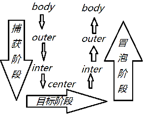
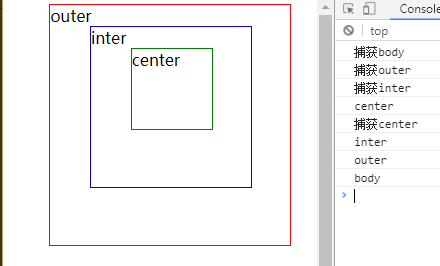

[TOC]

#jquery （选择器 属性...）事件(绑定 对象...)
###jquery中的选择器
```
    //通过JQ选择器选择出来的是一个JQ对象,此时只可以使用JQ提供的方法
     JQ对象变成原生对象
    //JQ对象[索引]
    console.log($("#box")[0]==box);//true
     将原生对象变成JQ对象
    //$(原生对象)-->JQ对象
    console.log($(box));

   
     基本选择器
    //ID选择器
    $("#box");
    //类选择器
    $(".list");
    //标签选择器
    $("div");
    //通配符
    $("*");
    // 集合选择器
    $("div,p");

    层级关系选择器
    //后代选择的器
    $("div p");
    //子代选择器
    $("ul>li");
    //下一个弟弟选择器
    $("div+p");
    //所有的弟弟选择器
    $("div~");

    基本过滤选择器
    //:first
    $("#ul li:first");
    //:last
    $("#ul li:last");
    //:odd 奇数 索引是奇数
    $("#ul li:odd");
    //:even 偶数 索引是偶数
    $("#ul li:even");
    //:not() 非,不是的意思
    $("#ul li:not('.list')");
    //:eq(n) 索引
    $("#ul li:eq(3)");
    //:gt(n) 索引大于n的
    $("#ul li:gt(2)");
    //:lt(n) 索引小于n的
    $("#ul li:lt(2)");
    //:header 获取所有的h1-h6标签
    $("#box :header");
    //:animated获取所有的正在进行动画的标签(js动画,CSS3动画不行)

    内容过滤选择器
    //:contains(内容)  选择出含有指定内容的元素
    $("#ul li:contains('呵呵')");
    //:has()
    $("div:has(p)");//包含p标签的div
    //:empty 空元素
    $("span:empty");
    //:parent 非空元素
    $("span:parent");

     可见性过滤选择器
    //    1.  :hidden 隐藏元素  只针对display:none这种隐藏方式
    console.log($("p:hidden"));
    //    2.  :visible 可见元素
    

    属性过滤选择器
    //[属性名]
    $("li[class]");
    //[属性名=XX] 这里不是包含是完全相等
    $("li[class=list1]");
    //[class!=list1]
    //[class^=list]
    $("li[class^=list]");//"list1"也是以list作为开头
    //[class$=list]
    $("li[class$=list]");//"1list"也是以list作为结尾
    //[class*=list]
    $("li[class*=list]");//类名中只要是有list这个字母即可“listb”也可以
    //[class|=list]
    $("li[class|=list]");//类名必须是list或者是list-作为前缀
    //[class~=list]
    $("li[class~=list]");//li的类名必须有一个是list
    //所有class以空格分开后的class名中含有list的div


    子元素过滤选择器
    //1.  :nth-child(1)  第一个孩子
    $("div p:nth-child(1)");
    //2.  :nth-child(odd) 是第奇数个孩子
    $("div span:nth-child(odd)");
    //3.  :nth-child(even) 是第偶数个孩子
    $("div span:nth-child(even)");
    //4.  :nth-child(3n)  n从1开始 是第3的倍数个孩子
    $("div span:nth-child(3n)");
    //5.  :first-child
    //6.  :last-child
```
###jq中的常用属性和方法
```
 //JQ有一个很强大的功能就是链式写法
    // $("#box").css({width:100,height:100,background:"red",position:"absolute"}).animate({left:1000},2000);
    //1.文档处理
    var p1=document.createElement("p");
    p1.innerHTML="大家好我是p1";
    //原生方法
    box.appendChild(p1);
    JQ: 父级(JQ对象).append(元素,可以是JQ对象也可以是原生对象)
    //$("#box").append($("#span1"))
    //$("#box").append($("#span1")[0])
    //JQ对象.appendTo(父级)
    //$("#span1").appendTo($("#box"));

    父元素.prepend(子元素)   往父元素的前面加
    子元素.prependTo(父元素) 往父元素的前面加
    //$("#box").prepend($("#span1"))

   原生JS  父级元素.insertBefore(元素1,元素2)将元素1加在元素2前面
   JQ: after/before 加在当前元素的后面/前面
    //元素1.after(元素2)   在元素1的后面加上元素2
    //元素1.before(元素2)  在元素1的前面加上元素2
    //$(p1).before($("#span1"));

    JQ对象.insertBefore(指定元素)  将JQ对象加在指定元素的前面
    JQ对象.insertAfter(指定元素)   将JQ对象加在指定元素的后面
    $("#span1").insertAfter($(p1));

   remove()移除元素
    $("div").remove(".box");//将所有div中类名是box的div删除

   通过JQ方法的到的一个JQ对象
    //next()获取下一个弟弟元素
    //prev()获取上一个哥哥元素
    console.log($("#p1").next());
    //nextAll()获取所有的弟弟
    //prevAll()获取所有的哥哥
    //sibilings()获取所有的兄弟

   JQ方法有一个好处,获取出的是一组元素但是使用JQ方法的时候默认会给每一个元素使用
    $("#list li").css({background:"red",margin:30});
    $("#li0").css({background:"red"}).siblings().css({background:"green"});


    筛选
    //eq(索引),first(),last()
    $("#list li")[3];
    $("#list li").eq(3);//获取索引为3的JQ对象
    $("#list li").last();//获取最后一个
    $("#list li").first();//获取第一个

   filter:同级过滤
    $("#list li").filter("#li0");//在li中去选择ID是li0的li

   children:子级过滤
    $("#list").children("#li0");//从#list的孩子们中找id名是li0的

   find:后代过滤
    $("#list").find(".li1");//从#list的后代(子子孙孙中)找

    //parent()一个父亲
    //parents() 父亲们
    console.log($("#li0").parent());
    console.log($("#li0").parents());
    //#li0的父亲,父亲的父亲,父亲的父亲的父亲,...html

   attr()获取/设置属性,设置的属性都会显示在标签上
    $("#box").attr("zf","珠峰");
    //获取
    console.log($("#box").attr("zf"));
    //批量设置 {}
    $("#box").attr({zf:"zf",mq:"mq",lk:"lk"});

    prop 类似于原生JS中点的方法  新增属性名 属性值
   （内置属性会显示在HTML结构上,如果是自定义属性不会显示在html结构上）
    $("#box").prop("class","box"); //class可以输出来
    $("#box").prop("c","box"); //自定义的属性名不会输出来

    css()设置/获取样式
    // 获取 有单位
    console.log($("#box").css("width"));
    //设置 值可以加上单位也可以直接是数字
    $("#box").css("width","200px");
    $("#box").css("width",400);
    //批量设置 {}

    //offset()获取偏移量
    $("#box").offset().top;//上偏移量
    $("#box").offset().left;//左偏移量

    //scrollTop()/scrollLeft()
    //不传参数是获取,传参数是设置

    //width()/height()
    //不传参数是获取,传参数是设置
    console.log($("#box").width());

    innerWidth()/innerHeight() 类似于clientWidth/clientHeight
    //但是innerWidth()/innerHeight()不传参数是获取,传参数是设置
    //注意设置时候padding不变的改变的是width和height
    获取会加上padding
    
    

   outerWidth()/outerHeight()类似于offsetWidth/offsetHeight
    //不传参数是获取,传参数是设置
    //注意设置时候padding和border都不变的改变的是width和height
    注意:如果你传一个true是获取,并且获取包括margin

    //.log($("#box2").outerWidth(true));
    $("#box2").outerWidth(400);
```
###jq中的变量
```

   JQ对象.each()
    $(".box").each(function (index, item) {
        //item:当前项并且是一个原生对象
        //this:item
        console.log(index);
        console.log(item == this);//true
    });

   非jq对象遍历
   $.each(想要遍历的内容,function(){});
    var ary=[1,2,3];
    var boxs=document.getElementsByClassName("box");
    $.each(ary,function (index,item) {
        console.log(index,item);
        console.log(this==item);
    });
    $.each(boxs,function (index,item) {
        console.log(item==this);
    })
    //区别:遍历一个JQ对象使用each()方法即可,如果遍历一个非JQ对象可以使用$.each()方法
```
```
jQuery原型扩展
JQ原型上扩展,JQ对象(JQ实例)使用
    jQuery.fn.extend({   //fn相当于原型（prototype）
        getName:function () {
            return "name"
        }
    });
   $("#list").getName()//jq对象实例 去调用


 给JQ类本身扩展,使用的时候 $.函数()
    jQuery.extend({
        f:function () {
            return "你好"
        },
        f1:function (n) {
            return ++n
        }
    });


```


###jq动画
      /动画执行前先加一个stop（）
```
 $("#btn").click(function () {
        //show()/hide() //显示 隐藏
        //$("#box").show()
        //$("#box").hide();
        //show/hide("快fast"/"慢slow"/时间ms)
        //$("#box").hide("fast");
        //$("#box").hide("slow")
        //$("#box").hide(2000)

        //slideUp()/slideDown()/slideToggle() 收起来/展开
        //$("#box").slideUp();
        //$("#box").slideDown(3000);
        //$("#box").slideDown("fast");
        //$("#box").slideDown("slow");
        //$("#box").slideToggle() //自动 两次的效果

        //fadeIn()/fadeOut() //淡入 淡出
        //$("#box").fadeIn("slow")
        //$("#box").fadeIn(2000);
        //$("#box").fadeToggle(2000);

        //注意:执行动画之前先执行一个stop()  //多个动画，执行完了之后可以执行下一下动画，避免重复执行
        // $("#box").stop().slideToggle();
        //delay(时间)延迟
        //$("#box").stop().delay(2000).slideDown();
```
```
   
        8.动画延迟,在动画前面加一个delay(时间ms),因为hide()和show().不穿参数的时候没有动画效果,所以delay对他俩没有效果

        //$("#box").stop().delay(2000).fadeIn();

       /9.animate({目标值},duration,回调函数)
//        $("#box").stop().animate({top:600,height:100},2000,function () {
//            //this:当前执行动画的元素,这里的this是原生对象
//            //this.style.backgroundColor="red";
//            //$(this):JQ对象
//            $(this).css("backgroundColor","red");
//        })
        function down() {
            $("#box").stop().animate({top:600,height:100},2000,function () {
                $(this).css("backgroundColor","red");
                up()
            })
        };
        function up() {
            $("#box").stop().animate({top:100,height:60},1000,function () {
                $(this).css("backgroundColor","yellowgreen");
                down();
            })
        };
        down();
    })
```
###jq事件 小技巧
```
jq中的方法都要加括号
onclick=click;


```
```
 //proxy 相当于bind 改变this  不会让函数执行 要额外执行
    function fn() {
        console.log(this);
    }
    let f=$.proxy(fn,{});//函数，this
    f()
```
```
 //trim 去除首尾空格
     var str=" nn mm "
    console.log($.trim(str).length);//5
    console.log(str.length);//7
```
```
 //是否关闭动画效果
	//jQuery.fx.off=true;//关闭
	//jQuery.fx.off=false;//不关闭
```
```
//isEmptyObject(),判断是不是一个空对象{}/null也是空对象
    //isPlainObject:判断是不是一个对象,这里null就不是一个对象了
    console.log($.isEmptyObject({}));//true
    console.log($.isEmptyObject(null));//true 空指针对象
    
    console.log($.isPlainObject({a: 1}));//true
     console.log($.isPlainObject({}));//true
    console.log($.isPlainObject(null));//false
```
###jq表单
```
	$("#form1 :enabled");//选取form1下面的所有可用元素
			$("#form1 :disabled");//选取form1下面的所有可用元素
			$("#form1 :checked");//选出form1下所有被选中的元素
			$("#form1 select option:selected");//下拉选项被选中的元素
			$("#form1 :input");//input textarea select button
			$(":text");//所有的单行文本框
			$(":password");//所有的密码框
			$(":radio");//所有的单选框
			$(":checkbox");//所有的复选框
			$(":submit");//所有的提交按钮
			$(":image");//所有的图片按钮
			$(":button");//所有的按钮
			$(":reset");//所有的重置按钮
			$(":file");//所有的上传域
			$(":hidden");//所有隐藏元素
```
##$.Callbacks()回调函数列表对象(重点)
```
Callbacks就是订阅发布的模式，add是订阅，fire是发布；


   let $a=$.Callbacks();
   console.log($a); //是一个回掉函数集合
    //{add: ƒ, remove: ƒ, has: ƒ, empty: ƒ, fire:f
    add回掉函数集合 add往集合里面增加函数 回掉函数是异步的,必须通过fire让它执行
    function fn1(n) {
        console.log("fn1",n);
    }
    function fn2(n) {
        console.log("fn2",n);
    }
    function fn3() {
        console.log("fn3");
    }
     *方法：add可以执行多次，也可以一次增加多个函数  【添加函数】
    $a.add(fn1);
    $a.add(fn1,fn2,fn3);

    *方法：fire 让集合中所有的函数执行，并按照add加入的顺序执行 【执行】
//    $a.fire(1,5); //fire 传的只是集合中每个函数的参数 并且函数按顺序执行

    *方法：remove  从集合中移除函数 【添加函数】
     $a.remove(fn1);
      $a.fire(); //执行移除后的函数
   *has判断集合中有没有指定函数，返回true/false
   console.log($a.has(fn1)); //true

    //empty   清空数组中的所有函数
    $a.empty();
    $a.fire();
    $a.add(fn1);  //清空后在添加在执行
    $a.fire();//fn1 undefined （没有传参数）


    *this 问题
   console.log($.Callbacks(this));//$a 数组集合


    function fn() {
        console.log(this); //里面的每个函数也是输出这个$a 数组集合
    }
    let $cb=$.Callbacks();
    $cb.add(fn);
    $cb.fire();
```
$.Callbacks重写实现方法
```

        //类的原型上的共有的的方法，中的this是但当前实例
        //indexof  有当前项，返回当前项的索引，没有返回-1；就是删除最后一项
        function Callbacks() {
            //给实例增加私有属性，一个数组，当作回掉函数的集合；
            this.CB=[]
        }
        Callbacks.prototype.has=function (fn) {
            //this 是当前实例
           return this.CB.includes(fn)
        };
        Callbacks.prototype.add=function (...arg) { //不确定有几个 ,传进来的是函数，函数集合
            //循环arg判断每一项必须是一个函数并且之前集合中没有,往this的CB中放
            arg.forEach((item)=>{
                if(typeof item=="function"&&!this.CB.includes(item)){//并且CB数组中之前没有这个函数
                    this.CB.push(item);
                }
            });
            return this;
        };

        Callbacks.prototype.remove=function (...arg) {   //arg是每个函数集合
            //遍历集合中的每一项，有就移除，没有就不需要移除
            arg.forEach((item)=>{
                if(this.has(item)){ //用实例去调用has方法（判断cb中有没有）
                    this.CB.splice(this.CB.indexOf(item),1)//删除当前项
                }  //这些都是this.CB(数组)去使用数组的方法
            })

        };
      //让集合中的函数依次执行
        Callbacks.prototype.fire=function (...arg) {       //fire后面是每个函数的参数
            //让每一个函数执行的时候，里面的this变成当前实例；
            this.CB.forEach((item)=>{  //不能循环arg，arg在fire中表示参数，this.CB就是一个数组，循环数组中的每一项
                item.apply(this,arg) ;  //让集合中的每一个函数只执行，arg是个数组
            })
        };
        //

var a=new  Callbacks;
 function fn() {

 }
    a.add(fn)
```
###$.Callbacks方法升级重写    fire(type)执行  [执行type中的函数]
```
function Callbacks() {
    this.CB=[];
}
Callbacks.prototype.has=function (type,fn) { //has方法返回Boolean值，要转化一下Boolean
    return !!this[type]&&this[type].includes(fn);//先判断有没有这个类型，然后再看里面有没有这个函数
};
Callbacks.prototype.add=function (type,...arg) { //arg是函数数组
    if(!this[type]){
        //如果没有这个类型，先给实例增加一个
        this[type]=arg.filter((item)=>{return typeof item=="function"})
    }
    else{ // 如果有了这个类型 就直接放 ，判断之前有的类型中没有这个函数，不要重复
        arg.forEach((item)=>{
            if(typeof item=="function"&&!this[type].includes(item)){
                this[type].push(item);
            }
        })

    }
};
Callbacks.prototype.remove=function (type,...arg) {//arg是函数数组
    if(this[type]){ //有这个类型
    
        arg.forEach((item)=>{   //删除这个数组中对应索引的每一项
            if(this.has(type,item))  {this[type].splice(this[type].indexOf(item),1)}
        })
    }
};
Callbacks.prototype.fire=function (type,...arg) { //arg是函数数组中每一个函数的参数
    if(this[type]){
    
**注意循环的是this[type]这个数组
        this[type].forEach((item)=>{ //类型下的属性值，数组中的每一项
            item.apply(this,arg) ;//每一项函数中的this是 实例 ,传参
        })
    }
};
```
#事件
### 事件类型
```
事件分为两部分:事件行为,事件的绑定
事件行为:是元素天生自带的属性,浏览器赋予其的行为
事件的绑定:就是给事件行为绑定的函数

常用的事件行为(事件属性)
onabort 图像加载被中断触发的行为
onload  当图片或者一个网页加载完成后触发的行为  
//onload事件 img.onload/window.onload
onerror 当加载文档或者图片发生错误后触发的行为
onblur 元素失去焦点
onfocus 元素获取焦点
onchange 域的内容改变 <input type="text/file"> textarea select
oninput 当输入框正在输入的时候
onclick 当元素被单击
ondblclick 当元素被双击
onreset 当重置按钮被点击的时候  form
onsubmit 当提交按钮被点击的时候  form
onunload 当用户退出页面之后触发 的行为  window.onunload
onresize 当浏览窗口发生改变 window.onresize
onmouseup鼠标按键松开
onmousedown鼠标按键按下
onmousemove 鼠标按住拖动
onmouseover/onmouseenter 鼠标放上   （后者没有冒泡）
onmouseout/onmouseleave 鼠标移开    （后者没有冒泡）
onmousewheel 鼠标的滚轮


onkeydown 键盘键按下
onkeyup 键盘键松开
onkeypress键盘键按下再松开
当一个输入框按下键盘触发onkeydown 松开先触发onkeypress再触发onkeyup
注意:没有输入内容(enter,tab,中文的时候输入法会阻止一下)就不会触发onkeypress
```


### 事件绑定（JavaScript）
```
JavaScript DOM0、DOM2级事件简述：
1.DOM0级事件绑定:元素.事件行为=function(){}
给一个元素的同一个事件行为只能绑定一次,多次绑定,后面的就会覆盖前面的内容只会执行最后一个(原因:是直接给事件属性赋了一个值[地址值]而已);
DOM0级事件不存在兼容性,任何浏览器都可以
DOM0级事件的移除:元素.事件行为=null;

2.DOM2级事件绑定
addEventListener:EventYTarget类原型上的公有属性
元素.addEventListener("事件类型",function fn(){},true/false);
事件类型:事件行为(事件属性)前面的on去掉,例如onclick->click
true/false:可选的,规定事件发生的阶段(true:捕获阶段发生,false:冒泡阶段发生,不填默认就是false)

DOM2级事件的移除: 怎末绑定，怎末移除
注意:为了移除事件的时候方便绑定事件的时候最好使用函数名代替
元素.removeEventListener("事件类型",函数名,true/false)


*DOM2级事件存在兼容性：
在IE下使用:绑定attachEvent和移除detachEvent
特殊情况：
//document.body.attachEvent('onclick',fn);//=>fn中的this:window (IE6~8中的DOM2事件绑定)


*共存性：DOM0级和DOM2共存，但是执行顺序是按照绑定先后进行的，比如以下代码中先绑定DOM2
事件，再绑定DOM0事件结果先执行DOM2再执行DOM0
```
举例
```
 box.onclick=function () {
        console.log(1);
    };
   box.onclick=function () {
       console.log(3);
   }
//只会输出3


 var box=document.getElementById("box");
    console.dir(box);
    function fn1() {
        alert("第一次")
    }
    function fn2() {
        alert("第二次")
    }
    function fn3() {
        alert("第三次")
    }
    box.addEventListener("click",fn1);
    box.addEventListener("click",fn2);
    box.addEventListener("click",fn3);

    box.removeEventListener("click",fn2);//移除
    //每次的都会输出
```
###事件对象 (+键盘)
事件对象介绍
```
*事件对象:当触发这事件行为的时候,就会执行我们给他绑定的那个函数,当这个函数执行的时候浏览器会默认给他传一个参数,这个参数就是事件对象,这里买存储了当前触发这个事件行为的一些信息

注意:当你一次触发同一个事件行为的多个函数,事件对象是同一个,比如点击事件onclick,当你点击的一下的时候,鼠标只有一个,点击的次数也只有一次,浏览器只是把同一个事件对象分别传给了多个函数而已

*事件对象的兼容性
在低版本IE下浏览器不会默认传一个事件对象
1.事件对象:window.event
2.事件源:srcElement
3.没有pageX和pageY

*键盘事件对象
KeyboardEvent
```
事件举例
```
var  box=document.getElementById("box");
var  text1=document.getElementById("text1");
box.onclick=function (e) {
    //e:浏览器默认传的参数,事件对象
    console.log(e);
    //e==MouseEvent:鼠标事件对象
    e.clientX;//点击的那一下,鼠标距离浏览器左边的距离;
    e.clientY;//点击的那一下,鼠标距离浏览器上边的距离;
    e.pageX;//点击的那一下,鼠标距离整个网页左边的距离;
    e.pageY;//点击的那一下,鼠标距离整个网页上边的距离;
    e.type;//事件类型 addEventListener第一个参数
    e.target;//事件源,谁执行的事件,事件源就是谁
};
document.body.onclick=function (e) {
    console.log(e);
};

*键盘对象及其对应数值
text1.onkeyup=function (e) {
    console.log(e.keyCode);
    //KeyboardEvent
    e.key;
    e.keyCode;//键的键值
    //空格:32
    //左:37,上:38,右:39,下:40
    //enter/return:13
    //shift:16
    //alt:18
    //ctrl:17
    //Del:46
    //delete/Backspace:8
}
```
- 事件对象重复
```
   box.onclick = function (e) {
        console.log(e);
    };
    document.body.onclick = function (e) {
        console.log(e);
    }
    情况一：点击box 输出两个相同的事件对象e，box和body是一个事件源e.target（都是box的）
    
    情况二：单独单击body 事件源是body
    
```
- 阻止事件默认行为
```
return false;
e.preventDefault;
returnValue=false;
```
###事件的传播机制       捕获->目标>阶段
```
*捕获阶段（从外到里输出）=》目标阶段(作为目标反过来输出，(点击的那个也是事件源），先输出冒泡阶段，在输出捕获阶段)=》冒泡阶段(从里到外输出)
   * 事件触发，先捕获，在冒泡
   * 事件传播是可以阻止的，只可以阻止冒泡阶段，捕获阶段不能阻止
   * DOM0级事件只会在冒泡阶段发生
在捕获阶段或者冒泡阶段如果中间某一个元素没有绑定事件,仍然会传播

```


- 盒子模型实例证明
```
//DOM零级事件 只有冒泡阶段
 body.onclick=function () { 
	 console.log(this.id);
 };
 outer.onclick=function () {
	 console.log(this.id);
 };
 center.onclick=function () {
	 console.log(this.id);
 };
 inter.onclick=function () {
	 console.log(this.id);
 };
//DOM二级事件绑定 有捕获阶段（true表示）
 body.addEventListener("click",function () {
	 console.log("捕获"+this.id);
 },true);
 outer.addEventListener("click",function () {
	 console.log("捕获"+this.id);
 },true);
 center.addEventListener("click",function () {
	 console.log("捕获"+this.id);
 },true);
 inter.addEventListener("click",function () {
    *e.stopPropagation();//阻止冒泡
		//stopPropagation 在低版本IE下没有
		//在低版本IE下:window.event.cancelBubble
	 console.log("捕获"+this.id);
 },true)
捕获阶段先输出=》目标阶段（点击的center，它就是目标阶段/事件源 注意反过来输出）=》冒泡阶段
```
事件传播 就是事件对象的传播


####引发出事件委托

```
给外面的元素绑定事件,利用事件冒泡不管触发里面的哪一个元素都会让这个事件执行,此时只需要根据事件源是谁做不同的处理即可,这种方式就是事件委托
	*一般都是委托给当前区域的最高级
	////点击center 让body变成green
	//点击inter 让body变成blue
	//点击outer 让body变成red
	body.onclick=function (e) {
		if(e.target.id=="outer"){
			this.style.backgroundColor="gold"
		}
		if(e.target.id=="inter"){
			this.style.backgroundColor="blue"
		}
		if(e.target.id=="center"){
			this.style.backgroundColor="red"
		}
	}
```
- 阻止事件冒泡             阻止跳转行为 
```
阻止事件冒泡 
     e.stopPropagation
<!--
	a标签的默认行为:页面跳转,锚点链接
	-->
	<a href="#box">调到box</a>
	<a href="https://www.baidu.com/">百度</a>
	<a href="https://www.zhufengpeixun.cn/">珠峰培训</a>
	<div id="box"></div>
	<script type="text/javascript">
    var all=document.getElementsByTagName("a");
		all[1].onclick=function (e) {
//			alert(1);
			e.preventDefault();//阻止a连接跳转
//			return false;//写法二
		}
```
###JQ事件    JQ事件绑定  高级事件on off（注意this）


```
DOM2级事件绑定
  事件绑定
  $("#box").click(function (e) {
        console.log(e);
        //事件对象,是一个JQ对象,不用担心跟原生的事件对象一样使用
        e.target;
        e.clientX;
        e.clientY;
        //this,给谁绑的就是谁,原生对象
        console.log(this);
    });
```
```
jQuery高级事件绑定---on、off、one和事件委托  this==事件源
on( )

    function fn(e) {
        console.log(e.data); //刚开始是undefined
//        console.log(1);
    }
function fn1(e) {
    console.log(2);
}
function fn2(e) {
    console.log(3);
}
*$("#box").on("click",fn).on("click",fn1)//绑定事件 绑定多个事件
    $("#box").off("click",fn)//移除事件

*on （"click touchstart",function(){})//可以绑定多个事件 但是函数只有一个
*命名空间
    $("#box").on("click",fn).on("click.f",fn1).on("click.f",fn2)//绑定事件
    $("#box").off("click.f")//移除事件
 *//事件对象的data对象存储内
    $("#box").on("click",{name:"fill"},fn);
 
  *.给事件对象增加数据,存在e.data
  
 *JQ预留事件(实现原理就是事件委托);
    $(".list").on("click","li",function (e) {
        alert(e.target.innerText);
        //this:当前点击的li元素
        console.log(this);
    });
    $(".list").append("<li>5</li>");
    $(".list").append("<li>6</li>");

    //delegate:处理预留事件的,注意参数顺序
    $(".list").delegate("li","click",function (e) {})

```
####事件委托
```
事件委托
【解释】：
事件委托就是利用事件冒泡原理实现的！
事件冒泡：就是事件从最深节点开始，然后逐步向上传播事件；
例：页面上有一个节点树，div > ul  > li  >  a
比如给最里面的a 加一个click 事件，那么事件就会一层一层的往外执行，执行顺序 a > li > ul > div,  有这样一个机制，当我们给最外层的div 添加点击事件，那么里面的ul ， li  ， a  做点击事件的时候，都会冒泡到最外层的div上，所以都会触发，这就是事件委托，委托他们父集代为执行事件；


【解释】：实际上是给祖先绑定一个事件。子元素通过冒泡将事传递到祖先元素，祖先元素再判断点击的是不是button，如果是，就执行相同的事件。因此，当有很多个相同的按钮需要绑定相同的事件时，可以用事件委托将事件委托给祖先节点，有祖先节点判断子节点是否执行某事件。如果不适用事假委托，那个每一个节点都需要绑定一个事件。
使用方法是：
祖先节点.on(“事件”,”子元素”,”绑定的函数”);

on的第二个参数需要写成所有相同元素通用的写法，不能写成:button:eq(0)这样的选择不具有通用性，祖先节点在判断的时候会无法达到预期的效果。
```
####JQjQuery高级事件绑定实现原理（原生绑定实现）
```
 1.data 是一个对象,给e增加一个属性data存储这个值
2.str 处理预留事件,事件委托,str要作为事件源
3.str只要是传了,此时事件源必须是str才可以执行绑定的函数,并且要把函数中的this变当前事件源
4.str没传,直接执行绑定的函数,函数中的this就给on方法中的this

  <ul id="list">
    <li></li>
    <li></li>
    <li></li>
  </ul>


    list=document.getElementById("list");
    //在ul的原型上增加自定义属性，新增方法
    EventTarget.prototype.on=function (type,...arg) {
        let str='',data=null,callback=null;
        arg.forEach((item)=>{
            if(typeof item=="string"){str=item}
            if(typeof item=="function"){callback=item}
            if(item&&item.toString()=="[object Object]"){data=item}
        });


   let fn= function fn(e) {//判断事件源，事件源必须必须放在函数里面；就是点击对象

        if(data){e.data=data}
        if(str){//如果传了str(selector)，事件源要是点击的那个（原生donm二级事件点击的那个，它的事件源）
            if(e.target.tagName==str.toUpperCase()){//tagame要转换成大写
                callback&&callback.call(e.target,e);
            }
        }

        else{ //不传str(selector)，this就是原生donm二级事件中的this
            callback&&callback.call(this,e);
            //第一个改变this，第二个传参
        }


    };  *原型方法中的this指的是当前实例  在这里指list（就是ul）
        this.addEventListener(type,fn);//绑定事件//dom二级事件绑定 函数fn 里面的事件源是点击对象，但是this是给谁绑定的事件（谁 ul）
    };
function box(e) {
    console.log(this);//<li></li>
    console.log(e.target);//<li></li>
    console.log(e.data);//{name: "mingzi"}

}
    list.on("click","li",{name:"mingzi"},box)
   
   ！！这是一个点击事件 找到事件对象（事件对象在函数中所以有fn这个函数）给事件行为绑定函数，执行这个函数，在里面分析事件源
 "li",{name:"mingzi"} 都在box这个函数中执行，所以要增data，selector（str）
```

####JQ事件委托
```
给li加点击事件
("#list>li").on("click",function () { //点击的每个li，给li绑定的事件
    console.log(this);
    console.log(1);
});
$("#list").append("<li>5</li>"); //在这里新增li，最后一个li点击不会输出1


事件委托（预留事件）
给事件对象最高级加事件
    $("#list").on("click","li",function () { //将事件委托给 $("#list"),ul
        console.log(this);//this=“li（事件源）”
        //如果没有li this就是list（ul） 事件源还是点击对象li
        console.log(1);
    });
 $("#list").append("<li>5</li>");//在这里新增li，最后一个li点击会输出1


区分：原生DOM2级事件 this是给谁绑定的就是谁，事件源是点击对象
```


